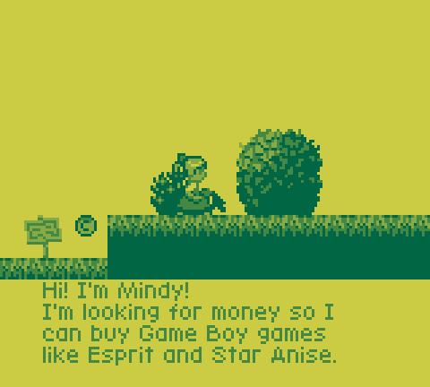
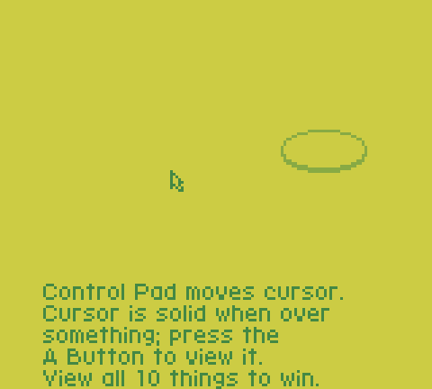
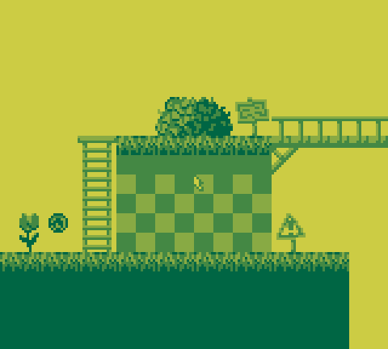

Mindy's Hike: First Look
------------------------

A short and sweet side-scrolling hidden object game for Game Boy
demonstrating scrolling, sprite drawing and movement, and text in a
proportional font.  Made in June 2023 for Eevee's [Games Made QVIIck]
jam, with intent to reuse the engine for a forthcoming platform game.

​Mindy wants to buy some Game Boy games. Read the signs, find the coins, and give them to Mindy.

Jam games don't have much space to explain how to play.

[Games Made QVIIck]: https://itch.io/jam/games-made-qviick-hd-remix

Copyright 2023 Damian Yerrick  
The jam version is distributed under the Apache License 2.0.
