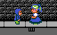

Howie
=====



Howie is a four-year-old runaway boy in the City who thinks he's
homeless.  He wears a blue hooded shirt over a green sleeping bag.
Because his legs developed differently, instead of walking, he jumps
(on a good day) or crawls (on a bad day).  At night, he listens to
lullabies on his music player and uses a headlamp to see.

Unlike some of the earlier bosses, who are defeated with one
purchase, Howie's quest is a chain of fetch quests: 1🪙️ at fast food
restaurant Lottie's, 3🪙️ at discount grocery Seed, 1🪙️ at pay
laundry Squeaky Clean, and 5🪙️ on a second trip to Seed.

Walkthrough
-----------

After gaining access to the City via the bus:

1. Talk to Howie.  Mindy explains that she's been told not to give
   money to panhandlers who might misuse it but is willing to help
   in other ways.
2. Enter Lottie's restaurant and talk to the cashier.  Mindy orders a
   kids' meal for Howie and an order of chicken nuggets for herself
   to go.  Mindy pays 1 coin and receives change of 1 cio, a small
   coin used for shopping cart deposit at the Seed grocery store.
3. Talk to Howie.  He and Mindy eat together, and Mindy reads the
   book included with the meal to Howie.  Howie begins to open up
   more to Mindy, explaining that he hops because he never learned
   to walk the regular way.  The two agree on a shopping list.
4. Enter Seed store.  Only plot-relevant items can be purchased,
   totaling 3 coins: batteries, meal bars, and a spare shirt.
5. Talk to Howie.  Mindy opens the items and gives them to Howie,
   and Howie stands up and hops behind Mindy to the coin laundry.
6. Enter Squeaky Clean and head to the service desk.  The cashier
   gives Mindy a bathroom key.  Head to the bathroom.  Howie enters
   and changes into his new shirt.  (Clock wipe.)  Howie leaves the
   bathroom with all his clothes in hand and hops toward a washer.
   Return to the service desk, return the bathroom key, and pay 1
   coin for detergent, a wash token, and a dry token.  Use the washer
   next to Howie.

While the washer runs, Howie begins to explain what went on from his
point of view.  A couple days ago, his poor single mom told him to go
outside and said she wouldn't be letting him back in for what seemed
to a four-year-old like a long time.  He thought he had just become
homeless and started hopping around the city begging, with a bright
idea to make mom not poor anymore.  Howie goes on, spouting jumbled
recollections of "Hansel and Gretel" and "The Little Match Girl" that
mom had read to him before until "ding!"  The washer's done; time to
start the dryer.

7. Use the washer, and then use any available dryer.  Mindy asks
   Howie if he knows where he used to live.  Howie says he can take
   her there once his bag is dry.  (Clock wipe.)  Mindy pulls the
   clothes out of the dryer and watches Howie put them on.  While
   Howie is seated to pull the bag over his feet, Mindy notices the
   webbing between Howie's legs that keeps him from walking.
8. Follow Howie back home.  He finds the door locked, and knocking
   gives no answer.

The two try to think of more respectable things to do for money.
They put batteries in Howie's music player and try singing,
but Howie would need practice to carry a tune.  And then Mindy
remembers something she saw in Seed: a flat-packed child-size
lemonade cart.  She instructs Howie to wait behind the house while
she grabs something.

9. Return to Seed and buy a lemonade cart for 5 coins.  Take it to
   Howie.  Open it and assemble it.

Howie's mom gets home.  Howie hops out from behind the house and
asks "Can I come back in now?" As a reward for bringing Howie
back safe and sound and not escalating things despite the grave
miscommunication, mom gives Mindy a spare headlamp.

Businesses
----------

### Lottie's


- Sector: Quick service restaurant
- Location: City
- Objective for boss: Howie
- Featural spelling: L-O-T-T-II-S

Lottie's is a quick-service restaurant chain selling hamburgers.
Its mascot is Lottie, a girl with (legally distinct) pigtails.
It calls its combos Square Meals because their food doesn't cut
corners in freshness.

Lottie was first drawn as one of the [Popslide Girls] in
January 2017, an attempt at mascots for a software library.
In-universe, *Popslide Girls* is a children's book series about a
group of four preteen girls who go on adventures around the local
playground: Lottie and her friends Darcy, Gileina, and Civona.
It's quite a bit less fantastic than McDonaldland, and even though
it is an obvious corporate tie-in, it has fans as passionate as
*My Little Pony: Friendship Is Magic* or *The Baby-Sitters' Club*
has had in the real world.  When Lottie's isn't running a toy
collaboration, its Kids' Meal comes with a booklet containing an
excerpt from the next *Popslide Girls* book.

After Mindy buys Howie a kids' meal from Lottie's and an order of
nuggets for herself (1🪙️), they eat together and read the book
together.  The rest of the shopping list unlocks as Mindy helps
Howie climb Abraham Maslow's [hierarchy of needs].

[Popslide Girls]: https://forums.nesdev.org/viewtopic.php?t=15412
[hierarchy of needs]: https://en.wikipedia.org/wiki/Maslow's_hierarchy_of_needs

### Seed


- Sector: Discount grocery focusing on private-label products;
  limited garden supplies and impulse buy merchandise
- Location: City
- Objectives for boss: Howie
- Featural spelling: S-II-D
- Strapline: Shop. Save. Grow.

Seed is a discount grocery store chain modeled after ALDI Süd,
with a low-frills aesthetic.  Most shelves have store-brand food.
The ImPulse aisle (from "impulse buy", "pulse" meaning the rhythmic
flow of products through the aisle, and "pulse" meaning dried edible
legume seeds) has "what you need, when you need it": a weekly
rotating assortment of other merchandise.

One section of ImPulse always seems to have garden supplies (to be
modeled after Rachael S. Johnston's review of [Gardenline gear]
and explanation of [seasonal items]).  Even in the winter, they
still push gardening with store-brand chia planters.  One gets the
impression that one of the chain's owners believes in decentralized
food security through backyard gardening.

The logo of Seed resembles a seedling (🌱, U+1F331) to represent
freshness while resembling the letter S in featural (two strokes
starting at top left that curve inward and toward right center).

To deter cart theft, Seed keeps its shopping carts locked.  A 1 cio
coin (value 1/40🪙️) unlocks a cart and is refunded when the cart is
returned to the stack.

After keeping a 1 cio coin (value 1/40 of a coin) from change at
Lottie's, Mindy can pay the cart deposit at Seed.  Mindy buys these
for Howie:

- A box of 10 meal bars (1🪙️) from grain snacks aisle
- Batteries for his headlamp and music player (1🪙️) from checkout
- Spare undershirt (1🪙️) from ImPulse
- A lemonade cart (5🪙️) from ImPulse, resembling [Step 2's cart],
  once Howie tells Mindy that he really just wanted to start a
  business to help his poor single mom who is struggling to care for
  a special needs kid

Note: Unlike real-life ALDI, Seed sells alkaline batteries.

Special thanks:

- Roksim on eevee's hobbies for being the first to suggest garden
  supplies
- Zeta on NESdev for helping to find Howie's misunderstanding

[Gardenline gear]: https://www.aldireviewer.com/ive-been-gardening-most-of-my-life-and-these-are-the-best-aldi-gardening-supplies-ive-used/
[seasonal items]: https://www.aldireviewer.com/what-are-aldi-seasonal-favorites/
[Step 2's cart](https://www.aldireviewer.com/alexs-lemonade-stand-back-at-aldi-for-the-6th-year/)

### Squeaky Clean

- Sector: Pay laundry
- Location: City
- Objective for boss: Howie

Once Howie has a spare shirt to wear, Mindy buys a box of detergent
and washer and dryer tokens (total 1🪙️) from a cashier who's some
species of anthro rodent and washes and dries Howie's clothes.

Dialogue
--------

```
MINDY
How'd you end up on the
street?

HOWIE
Mom told me to go outside
and not come back in.

MINDY
When was that?

HOWIE
I don't know. It's been
days. I was trying to
be good and do what Mom
told me.

I thought Mom didn't want
me around because we're
so poor. So maybe I could
help her not be poor.

MINDY
What made you think that?

HOWIE
Mom told me about these two
kids whose dad couldn't
afford to feed them, so
their mom kicked them out.

They ended up at a cookie
shop in the woods whose
owner wanted to eat them.

Mom told me about this other
girl whose dad would beat
her unless she sold matches
on the street.

She lit all the matches
she had to keep warm and
remember her grandma until
she froze to death.

MINDY
Oh wait, I think I've heard
those stories.

It looks like the washer
is done. Let me go get
your clothes out.

(Mindy moves the clothes from the washer to the dryer.)

MINDY
Do you know where you used
to live before you were
kicked out?

HOWIE
Sure.

MINDY
Maybe we can go there once
your clothes are dry.

(Clock wipe.  Mindy pulls the clothes out of the dryer.)

MINDY
Here are your clothes.
Will you need any help?

HOWIE
No thanks. I can do this
all by myself.

(Howie sits down and lifts his feet to slide them into the bag.)

MINDY
What's that around your
legs?

HOWIE
Mom told me I'm like a
little penguin with my
legs stuck together.

MINDY
Oh, so that's why you hop.

(Mindy follows Howie to a house.)

MINDY
Is this where you used
to live?

HOWIE
Yep.

(Mindy tries the door and knocks.)

MINDY
I don't think anyone's home.

I wonder if there's anything
you can do for money other
than begging. Can you sing?
Play an instrument?

HOWIE
I've got my music player.

(Howie turns on a music player.)

HOWIE
Twinkle, twinkle, little
star, how I wonder what you
are. Up above the world--

(Mindy cringes and puts her hands to her ears.)

MINDY
I think you'd need more
practice to carry a tune.

What to do, what to do...

Wait... I saw something
at Seed that might help.
You wait here behind the
house.

HOWIE
Okay.

(Howie hops behind the house.  Mindy returns to Seed, buys a
flat-pack lemonade cart, and carries it back to Howie.)

MINDY
Look what I bought!
You can sell lemonade and
make money that way.

Just give me a few minutes
to put it together.

(Mindy unpacks and assembles the cart.  Howie's mom arrives.)
```
