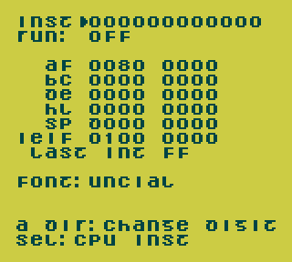

Game Boy instruction exerciser
==============================

This is a small ROM used to interactively test CPU instruction
behavior in a Game Boy emulator, even one without a debugger.
Use it to demonstrate half-carry and DAA behavior differences.

Display

* `INST`: Edit up to 6 bytes of Sharp SM83 machine code, one nibble
  at a time. (See [SM83 opcode matrix].)
* `RUN`: Change when the code is run.  Set to `OFF` (don't run),
  `PRESS A` (run when A is pressed and released), or `AUTO` (run
  after each digit change)
* `AF`, `BC`, `DE`, `HL`, `SP`: Set registers before execution, and
  see results after execution.  After `AF` result word is `ZNHC`,
  with space written instead of each flag that is clear (0).

Controls

* Up, Down: Move cursor among rows
* Left, Right: Change run type or move cursor in row
* A+Up, A+Down: Change nibble value
To change each nibble  (4-bit half byte drawn as one digit), hold A and press Up or Down.

[SM83 opcode matrix]: https://gbdev.io/gb-opcodes/optables/

