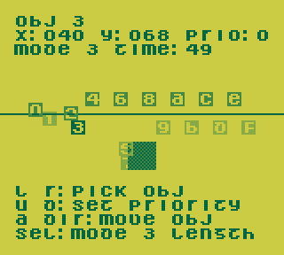

Game Boy interactive exerciser
==============================

This is a small ROM used to interactively test behaviors in a
Game Boy emulator, even one without a debugger.  Press Select to
choose an exerciser.

CPU exerciser
-------------
Use this to demonstrate half-carry and DAA behavior differences.

Display

* `INST`: Edit up to 6 bytes of Sharp SM83 machine code, one nibble
  at a time. (See [SM83 opcode matrix].)
* `RUN`: Change when the code is run.  Set to `OFF` (don't run),
  `PRESS A` (run when A is pressed and released), or `AUTO` (run
  after each digit change)
* `AF`, `BC`, `DE`, `HL`, `SP`, `IEIF`: Set registers before
  execution at left, and see results after execution at right.
  After `AF` result word are flags `ZNHC`, with space written
  instead of each flag that is clear (0).
* `LAST INT`: The address of the called IRQ handler (40-60), or
  FF if none was called.

Controls

* Up, Down: Move cursor among rows (register pairs)
* Left, Right: Change run type or move cursor in row
* A+Up, A+Down: Change nibble value

Execution environment

* The code is run with interrupts disabled.
* `rst xx` loads `(($C7 | x) << 8) | x` into HL.

[SM83 opcode matrix]: https://gbdev.io/gb-opcodes/optables/

Sound exerciser
---------------
Use this to poke at audio registers and see how they read back.

Display

Each row represents one or set of control registers as two rows of
digits.  The top row contains values to write; the bottom contains
values continuously read back from the APU.

* `PULSE1`, `PULSE2`, `WAVE`, `NOISE`: The four channels
    * `SW`: Pitch sweep (pulse 1) or playback switch (wave)
    * `LN`: Length counter and pulse duty
    * `VF`: Volume and fade
    * `PP`: Period (middle, low, high)
    * `L`: 4 to use length counter; 0 to hold note
* `CTRL`: Chip-wide control registers
    * `VV`: Overall volume of left and right outputs
    * `CC`: Channels enabled on left and right outputs
    * `P`: APU power switch
    * `S`: Channel status (read-only)

Controls

* Up, Down: Move cursor among rows (channels)
* Left, Right: Move cursor in row
* A+Up, A+Down: Change nibble value
* A: Write all bytes of channel, starting a new note
* B: Overwrite only one byte in the channel

DAA exhaustive tester
---------------------
Almost all electronic digital computers count in base two, whereas
most human cultures count in base ten.  The Game Boy CPU includes an
instruction `daa` (decimal adjust accumulator) to support calculation
in [binary-coded decimal] (BCD), where each nibble (4-bit hexadecimal
digit) in a number represents one digit 0 through 9.  In essence, the
instruction pretends that the nibbles in the operands of the last
`add`, `adc`, `sub`, or `sbc` were decimal digits and calculates
what the result in base 10 should have been.

The following steps model what the CPU does:

1. If N == 0 (addition) and A >= $9F: Set C (carry)
2. If N == 0 and (A & $0F) >= $0A: Set H (half carry)
3. `adjustment` is ($06 if H else $00) | ($60 if C else $00)
4. Add or subtract `adjustment` based on N
5. If N == 0 and addition overflowed, set C (`daa` never clears C)
6. Z (zero) = A == 0, N unchanged, H = 0

This tests the `daa` (decimal adjust accumulator) instruction on
all 4,096 distinct AF (accumulator and flags) values, compares them
to the result of a software implementation of the above steps, and
draws a plot of where they do not match.  The black pixels in each
16x16-pixel square represents the errors from calculating `daa` with
one set of flags: bits 3-0 as X and bits 7-4 as Y.  The different
squares represent results with different sets of NHC flags.

Below the plot is the total number of errors.  It may be twice as
many as black pixels because while the plot disregards input Z flag,
the error count includes both Z clear and Z set.

After the plot appears, the `VALID ADDS` test adds all 10,000 pairs
of valid BCD bytes (those without A-F nibbles) and displays the
first pair where the `daa` instruction does not match the software
implementation.

[binary-coded decimal]: https://en.wikipedia.org/wiki/Binary-coded_decimal

Mode 3 duration measurer
------------------------
This measures the approximate duration of pixel drawing (mode 3)
on one scanline.  Ordinarily, the picture processing unit (PPU)
calculates four dots per CPU cycle, taking breaks at times to fetch
sprite patterns.  The amount these breaks add to mode 3 depends on
how many sprites are on the line and where they are positioned.

* Left, Right: Choose a sprite
* A + Control Pad: Move that sprite

